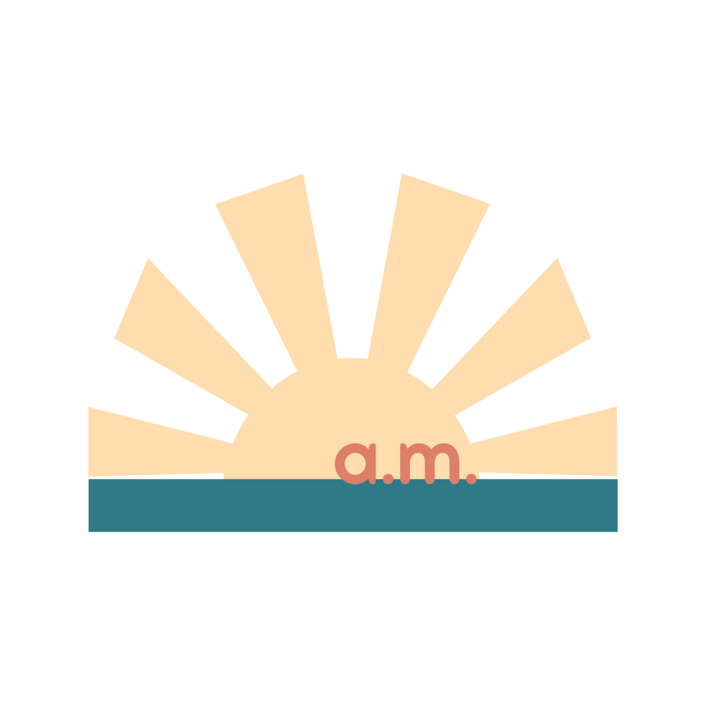

# IEC Gamified Training System

<div align="center">
  
  
  **A comprehensive gamified training platform for the electrical industry**
  
  *Developed in collaboration between the Independent Electrical Contractors (IEC) and A.M. Consulting*
  
  [](https://vercel.com)
  [](https://nextjs.org)
  [](https://www.typescriptlang.org)
  [](https://tailwindcss.com)
</div>

---

## 🎯 Project Vision

> *"If We Can Imagine It, Then We Can Create It."* - Altagracia Montilla

This project aims to revolutionize electrical industry training through gamification, artificial intelligence, and immersive project simulations. The platform features customizable avatars, real-world project simulations, comprehensive dashboards, and tracking metrics to enhance apprentice engagement and knowledge retention.

## 🚀 Key Innovations

<table>
<tr>
<td width="50%">

### 🧠 AI-Driven Learning
Personalized learning paths adapted to individual progress and preferences using advanced AI algorithms.

### 🎮 Gamification Engine
Points, badges, leaderboards, and achievement systems that create intrinsic motivation for continued learning.

</td>
<td width="50%">

### 🔧 Project Simulations
Interactive scenarios replicating real-world electrical projects with safe practice environments.

### 📊 Progress Tracking
Comprehensive dashboards providing detailed insights for apprentices, instructors, and administrators.

</td>
</tr>
</table>

### 🎨 Avatar Customization
Personalized avatars with unlockable customization options reflecting professional growth and achievements.

### 🌐 HigherSelf Network Integration
Leveraging enterprise-grade automation framework for robust user management and data integration.

## 📁 Repository Structure

```
iec-gamified-training-system/
├── docs/                           # Project documentation
│   ├── comprehensive-documentation.md
│   ├── implementation-roadmap.md
│   ├── platform-comparison.md
│   ├── technical-specifications.md
│   └── brand-guidelines.md
├── dashboard/                      # Vercel-deployable dashboard
│   ├── public/
│   ├── src/
│   ├── package.json
│   └── vercel.json
├── presentation/                   # Stakeholder presentation materials
├── assets/                        # Images, logos, and media files
└── README.md
```

## 🛠 Technology Stack

### Recommended Platform (Phase 1)
- **Frontend**: Softr (No-code platform)
- **Database**: Airtable Pro
- **AI Integration**: OpenAI API
- **Automation**: Zapier/Make
- **Hosting**: Vercel (Dashboard)

### Alternative Platforms (Phase 2+)
- **Advanced Development**: Bubble.io
- **Enterprise Gamification**: Bunchball Nitro
- **Mobile Apps**: React Native/Flutter

## 📊 Implementation Phases

### Phase 1: Georgia Pilot (Q4 2025 - Q1 2026)
- Core platform development
- Initial content creation
- 50-100 apprentices from 3-5 Georgia chapters
- 12-week pilot program

### Phase 2: Southeast Expansion (Q2-Q3 2026)
- Platform refinement based on pilot feedback
- Content library expansion
- Regional rollout to 200-300 users

### Phase 3: National Deployment (Q4 2026+)
- Nationwide availability to all IEC chapters
- Community building features
- Continuous improvement and enhancement

## 💰 Budget Overview

- **Pilot Program**: $75,000 - $100,000
- **Regional Expansion**: $150,000 - $200,000
- **National Deployment**: $300,000 - $500,000
- **Annual Operations**: $100,000 - $150,000

## 🎨 Brand Integration

<div align="center">
  
</div>

The platform incorporates official branding from both organizations to create a cohesive visual identity:

<table>
<tr>
<td width="50%" align="center">

**🔵 IEC Colors**
- Navy Blue: `#212b5e`
- Rust Red: `#ed2c28`

</td>
<td width="50%" align="center">

**🟢 A.M. Consulting Colors**
- Deep Teal: `#2a7d8c`
- Terra Cotta: `#d8765c`
- Warm Cream: `#f5f0eb`

</td>
</tr>
</table>

## 📈 Success Metrics

- **Engagement**: 80% of participants log in 3+ times per week
- **Completion Rate**: 90% module completion rate
- **Knowledge Gain**: 20% improvement in assessments
- **Satisfaction**: 85% positive user feedback

## 🔧 Development Setup

### Dashboard Development
```bash
cd dashboard
npm install
npm run dev
```

### Deployment to Vercel
```bash
vercel --prod
```

## 📚 Documentation

Comprehensive project documentation is available in the `/docs` folder:

- [Project Overview](docs/comprehensive-documentation.md)
- [Implementation Roadmap](docs/implementation-roadmap.md)
- [Platform Comparison](docs/platform-comparison.md)
- [Technical Specifications](docs/technical-specifications.md)
- [Brand Guidelines](docs/brand-guidelines.md)

## 🤝 Collaboration & Contact

<table>
<tr>
<td width="33%" align="center">

### 🏢 IEC
**Independent Electrical Contractors**

📧 info@ieci.org  
📞 (703) 549-7351  
🌐 [ieci.org](https://ieci.org)

*Industry expertise and chapter network*

</td>
<td width="33%" align="center">

### ☀️ A.M. Consulting
**Human Transformation & Innovation**

📧 contact@altagraciamontilla.com  
🌐 [altagraciamontilla.com](https://altagraciamontilla.com)

*Training innovation and Conflict Bravery™*

</td>
<td width="33%" align="center">

### 🔗 HigherSelf Network
**Technical Framework & Automation**

🔧 [GitHub Repository](https://github.com/Utak-West/The-HigherSelf-Network-Server)

*Enterprise-grade automation platform*

</td>
</tr>
</table>

### 🚀 Development Partners
- **GenSpark**: Project refinement and stakeholder presentation
- **Technical Team**: Platform development and implementation

---

<div align="center">
  
**🎯 Ready to Transform Electrical Training?**

*Join us in revolutionizing how the electrical industry trains its workforce.*

[](https://iec-gamified-training-system.vercel.app)
[](docs/)
[](mailto:contact@altagraciamontilla.com)

</div>

## 📄 License

This project is proprietary and confidential. All rights reserved by IEC and A.M. Consulting.

---

*"If We Can Imagine It, Then We Can Create It."* - Altagracia Montilla

## 🔄 Version History

- **v1.0** (September 2025): Initial project documentation and presentation
- **v1.1** (Planned): Pilot program launch preparation
- **v2.0** (Planned): Regional expansion implementation

